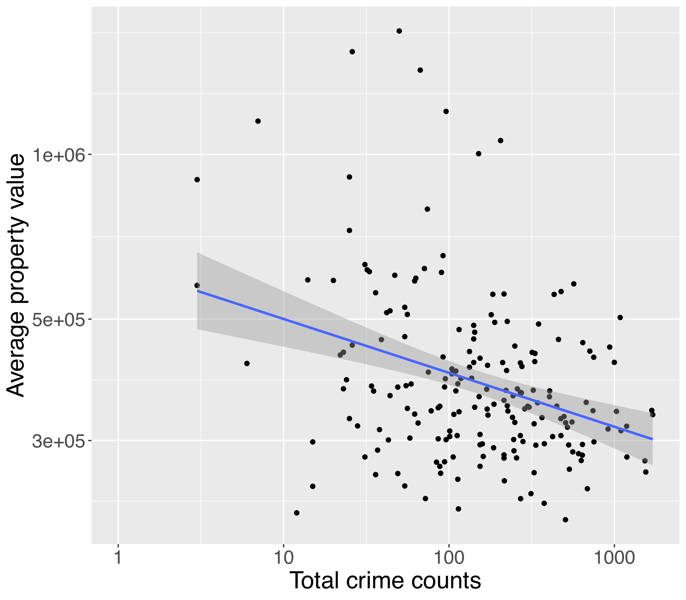

# Save Neighbourhood Project for Winnipeg Hackathon 2020
Investigation of crime rate versus property values in Winnpeg communities

Team (left to right):
Andy Reid, Juhee Kim, Julie Chih-yu Chen, Quoc Le, Tuan Huynh

GROUP PHOTO

Our prelimiary result

We also acknowledge Marcello Nesca, Wing Kwong, and Justin (from City of Winnipeg) for tips on sf R package.
